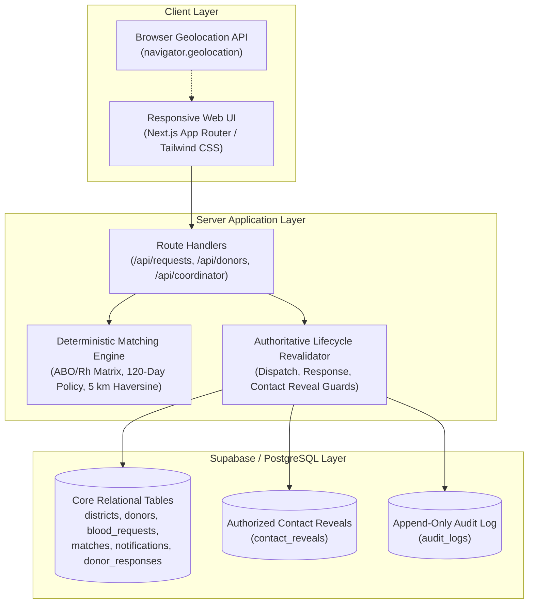

# Hemo Match

> **Rapid blood matching, protected by design.**

Hemo Match is a district-focused blood donor coordination prototype that replaces broad request broadcasting with targeted preliminary donor matching while keeping donor contact details protected until voluntary acceptance and explicit requester reveal.

[](https://nextjs.org/)
[](https://www.typescriptlang.org/)
[](https://tailwindcss.com/)
[](https://supabase.com/)

---

## Quick Links

- **Live Production Application**: [https://hemomatch.vercel.app/](https://hemomatch.vercel.app/)
- **GitHub Repository**: [https://github.com/rohanmgeorgeo/hemo-match](https://github.com/rohanmgeorgeo/hemo-match)
- **Challenge Track**: SC-12 — District Blood Donor Matching

---

## The Problem

In medical emergencies, blood requirements are frequently broadcast across public messaging groups and social media channels. This broadcast model introduces significant coordination friction:

1. **Broadcast Noise & Donor Fatigue**: Urgent alerts reach thousands of individuals who are incompatible, out of area, recently donated, or unavailable. Over time, repeated irrelevant pings cause eligible donors to mute notifications.
2. **Premature Contact Exposure**: Donor and patient phone numbers are shared across open chat groups before any intent or compatibility is verified, exposing donors to unsolicited calls and data harvesting.
3. **Lack of Coordination Visibility**: Requesters have no structured insight into candidate compatibility, response states, or whether the requirement has already been met—often resulting in zero responders or multiple donors arriving unannounced.

---

## Core Solution Flow

Hemo Match replaces indiscriminate broadcasting with an authoritative 5-stage coordination pipeline:

```
Request ──► Match ──► Notify ──► Accept ──► Reveal Contact
```

1. **Request**: Hospital representative or requester inputs patient blood group, required units, hospital facility, district, and required-by deadline.
2. **Match**: Server-side engine evaluates biological compatibility, conservative 120-day donation interval, and physical proximity to rank candidate donors deterministically.
3. **Notify**: Targeted in-app alerts are dispatched to matching candidate inboxes with duplicate-dispatch prevention.
4. **Accept**: Donors review logistical requirements (hospital locality, urgency, component) in their private inbox and choose to voluntarily **Accept** or **Decline**.
5. **Reveal Contact**: **Acceptance does NOT automatically expose the donor's phone number.** Contact details remain strictly protected until the requester explicitly triggers **Reveal Contact** on the accepted match.

---

## Three User Experiences

Hemo Match provides tailored workflows for each participant in district emergency coordination:

### 1. Requester Experience (`/requests/new`, `/requests/matching-demo`)
- **Intake**: Create emergency blood requirements specifying blood group, component, units, hospital, and deadline.
- **Discovery**: View preliminary matching candidate cards with masked contact tokens (`Donor •••• [SUFFIX]`).
- **Dispatch**: Send targeted in-app notifications to eligible candidates.
- **Track Responses**: Observe live response updates (`Notified`, `Accepted`, `Declined`) in real time.
- **Authorized Reveal**: Explicitly reveal donor name and phone number only after voluntary acceptance.

### 2. Donor Experience (`/donors/register`, `/donors/profile`, `/donors/notifications`)
- **Profile Registration**: Truthfully record blood group, district, locality, availability, and required Last Donation Date.
- **Interval Awareness**: Immediate feedback on whether the preliminary 120-day matching interval is satisfied.
- **Targeted Inbox**: Receive notifications strictly for compatible emergency requests in the district.
- **Voluntary Response**: Privately review request details and choose to Accept or Decline.
- **Profile Management**: Update availability status or donation history at any time (`/donors/profile/edit`).

### 3. Coordinator Dashboard (`/coordinator`, `/coordinator/requests/[id]`)
- **Operations Overview**: High-level visibility into district emergency requests, dispatch counts, and acceptance rates.
- **Lifecycle Tracking**: Inspect individual request progression through the 4-stage pipeline.
- **Privacy-Safe Monitoring**: Monitor coordination bottlenecks using masked donor tokens without accessing private contact details.

---

## Matching Logic: Deterministic, Not AI-Ranked

Hemo Match matching is **deterministic application logic**, not probabilistic AI ranking:

```
Eligible Donors in District Pool
        │
        ▼ 1. ABO/Rh Compatibility (Strict red cell transfusion matrix)
        │
        ▼ 2. Availability & Consent (availability = "available", consent = true)
        │
        ▼ 3. Required Last Donation Date & 120-Day Policy (elapsed days >= 120)
        │
        ▼ 4. Location Filtering (5 km Haversine radius OR same-district fallback)
        │
        ▼ 5. De-duplication (filter existing matches / prior responses)
        │
        ▼ 6. Deterministic 4-Tier Ranking
        │      ├── Tier 1: Homologous Match (exact blood group match first)
        │      ├── Tier 2: Physical Proximity (nearer straight-line distance ranks higher)
        │      ├── Tier 3: Elapsed Recovery (greater elapsed days since last donation ranks higher)
        │      └── Tier 4: UUID Lexicographical Tie-Breaker
        ▼
Ranked Candidate Matches
```

---

## Application Policy & Clinical Boundaries

> **Important Policy Statement**:
> *"The 120-day interval is Hemo Match's conservative application matching policy for this MVP. It is not a universal medical eligibility rule. Final donor eligibility is determined by qualified blood-bank/clinical personnel."*

- **Last Donation Date is Required**: To evaluate the preliminary 120-day matching interval, donors must provide their truthful Last Donation Date during registration and profile editing.
- **Registration vs. Matching Eligibility**: A donor whose last donation was recent (e.g., 30 days ago) **may still register**. Their profile will clearly reflect that the preliminary matching interval is not yet satisfied, and they will remain excluded from matching candidate pools until the 120-day threshold is met.
- **Legacy Donors with Missing Dates**: Any historical donor profile lacking a recorded donation date is safely excluded from matching (`EXCLUDE_DONATION_HISTORY_UNKNOWN`) and prompted with a non-alarming banner to update their profile.
- **Scope**: Current matching supports **Whole Blood** and **Red Blood Cells (RBC)**.
- **Clinical Non-Interference**: Hemo Match coordinates preliminary donor discovery only. Final clinical clearance, crossmatching, and deferrals belong strictly to licensed blood-bank personnel.

---

## Location & Proximity

- **Browser Geolocation**: Captures approximate device coordinates when permission is granted.
- **Haversine Distance**: Computes straight-line geometric distance between request coordinates and donor locality (not road routing or live traffic travel time).
- **5 km Application Radius**: Configured preliminary threshold prioritizing nearby community donors.
- **Same-District Fallback**: If coordinates are unavailable for either party, the system safely falls back to administrative district matching.
- **Privacy Guarantee**: Raw donor coordinates and exact residential addresses are never sent to requesters.

---

## Privacy by Design

Privacy boundaries are enforced at the architectural level:

- **Masked Matching Previews**: Donor candidate lists show only blood group, approximate locality, distance, and masked identifiers (`Donor •••• XXXX`).
- **Protection Throughout Dispatch & Acceptance**: When a donor receives a notification or clicks **Accept**, their telephone number remains hidden.
- **Two-Step Authorization Gate**: Donor phone numbers are unmasked only when:
  1. The donor has submitted an authoritative **Accept** response.
  2. The requester explicitly clicks **Reveal Contact**.
- **Server-Only Privileges**: Database operations with elevated privileges use Next.js server-only boundaries (`import "server-only"`).
- **Audit Trail**: Every reveal event is recorded in an append-only audit log with timestamp, request ID, and donor ID (without storing PII).

---

## System Architecture



---

## Tech Stack

- **Frontend**: [Next.js](https://nextjs.org/) 16 (App Router, Server Components, Route Handlers), [React](https://react.dev/) 19, [TypeScript](https://www.typescriptlang.org/) 5
- **Styling**: [Tailwind CSS](https://tailwindcss.com/) 4 with custom CSS variables for light/dark theme support
- **Database**: [Supabase](https://supabase.com/) / [PostgreSQL](https://www.postgresql.org/) (Row-Level Security, partial unique indexes, constraints)
- **Matching Engine**: Deterministic TypeScript application logic (pure, zero external network calls)
- **Geolocation**: Browser Geolocation API + Haversine formula
- **Notifications**: Internal in-app notification inbox
- **Deployment**: [Vercel](https://vercel.com/) (Edge routing, automated CI/CD)
- **Source Control**: GitHub

---

## Currently Working Features

- [x] **Blood Request Creation**: Validated request intake with blood group, urgency, units, hospital, and deadline.
- [x] **Request Lifecycle Guards**: Safe cancellation and editing locked once acceptance or reveal occurs.
- [x] **Deterministic Matching**: Pure matching engine enforcing 64-combination ABO/Rh rules and ranking.
- [x] **120-Day Application Policy**: Enforces preliminary recovery interval with boundary accuracy.
- [x] **Required Donation Date**: Enforced on registration and profile edit, with legacy null-date safety.
- [x] **Proximity & District Fallback**: 5 km Haversine radius with automatic district fallback.
- [x] **In-App Notification Dispatch**: Atomic claiming and duplicate-dispatch prevention.
- [x] **Donor Inbox**: View active incoming requests, urgency indicators, and logistical summaries.
- [x] **Voluntary Accept / Decline**: Idempotent response recording with server-side pre-response revalidation.
- [x] **Explicit Contact Reveal**: Unmasks donor name and phone only after acceptance and explicit requester action.
- [x] **Donor Profile Editing**: Edit contact, district, locality, availability, and last donation date.
- [x] **Coordinator Dashboard**: System overview with operational metrics and 4-stage request pipeline inspectability.
- [x] **Responsive Healthcare Design**: Spatial healthcare aesthetic with seamless Light and Dark mode support.

---

## Current Prototype Limitations

To maintain transparency, the following MVP boundaries are explicitly noted:

- **Demo Identity vs. Production Authentication**: The prototype utilizes browser-local demo donor identity; SMS OTP authentication and user login accounts are planned next steps.
- **Notification Channels**: Notifications are delivered through the in-app inbox; outbound SMS and WhatsApp messaging gateways are not yet connected.
- **Identity Verification**: Blood-bank clinical accreditation and donor government ID verification are not implemented in this prototype.
- **Distance Estimation**: Straight-line Haversine distance is used rather than real-time turn-by-turn routing or traffic estimation.
- **Component Scope**: MVP covers Whole Blood and Red Blood Cells (RBC); platelet apheresis and plasma are excluded.
- **Preliminary Coordination Only**: Hemo Match does not perform clinical blood testing, crossmatching, or final donor health qualification.

---

## Automated Verification & Test Results

The test suite runs via the native Node.js test runner via `tsx`:

```bash
npm test
```

### Verified Test Results (Final Release)

- **Test Count**: **280 passing tests**
- **Suite Count**: **81 passing test suites**
- **Failures / Regressions**: **0**
- **TypeScript (`tsc --noEmit`)**: Passed (0 errors)
- **ESLint (`eslint`)**: Passed (0 errors, 0 warnings)
- **Production Build (`next build`)**: Passed (13/13 static routes generated)

---

## Running Locally

### Prerequisites

- [Node.js](https://nodejs.org/) version 20 or higher
- [npm](https://www.npmjs.com/) version 10 or higher
- A [Supabase](https://supabase.com/) project with PostgreSQL

### 1. Clone the Repository

```bash
git clone https://github.com/rohanmgeorgeo/hemo-match.git
cd hemo-match
```

### 2. Install Dependencies

```bash
npm install
```

### 3. Configure Environment Variables

Create `.env.local` using the required variable names:

```env
# Public / Browser-Safe
NEXT_PUBLIC_SUPABASE_URL=https://your-project.supabase.co
NEXT_PUBLIC_SUPABASE_ANON_KEY=your-anon-key
NEXT_PUBLIC_APP_URL=http://localhost:3000

# Server-Only / Private (Never commit or expose to client)
SUPABASE_SERVICE_ROLE_KEY=your-service-role-key
```

### 4. Database Setup

Apply SQL migrations in `supabase/migrations/` sequentially via your Supabase SQL Editor:
- `0001_initial_schema.sql` — Core tables, constraints, enums, RLS
- `0002_notification_idempotency.sql` — Partial unique indexes for dispatch idempotency
- `0003_atomic_notification_dispatch.sql` — Atomic dispatch RPC
- `0004_atomic_donor_response.sql` — Atomic response RPC
- `0005_contact_reveal_authorization.sql` — Atomic contact reveal RPC
- `0006_proximity_matching_coordinates.sql` — Proximity matching coordinates and spatial constraints

### 5. Start the Development Server

```bash
npm run dev
```

Open [http://localhost:3000](http://localhost:3000) to view the application.

### Available Scripts

```bash
npm run dev          # Start Next.js development server
npm run build        # Build optimized production bundle
npm run start        # Start production server
npm test             # Run complete unit and integration test suite
npm run typecheck    # Run TypeScript validation (tsc --noEmit)
npm run lint         # Run ESLint validation
npm run seed:selection        # Seed deterministic evaluation donor dataset
npm run seed:selection:reset  # Clean evaluation donor dataset
```

---

## Live Demonstration Walkthrough

To experience the complete flow on the live deployment:

1. **Register Donor** (`/donors/register`):
   - Enter volunteer details with a valid **Last Donation Date >= 120 days ago** (e.g., 5 months ago).
   - Submit registration. Profile renders with masked telephone (`••••••XXXX`).
2. **Create Blood Request** (`/requests/new`):
   - In a second tab/window, submit an emergency requirement for a compatible blood group in the same district.
3. **Match** (`/requests/matching-demo`):
   - Review ranked candidate matches. Contact numbers remain completely masked.
4. **Notify**:
   - Click **Notify Donors** to dispatch targeted in-app alerts.
5. **Open Donor Inbox** (`/donors/notifications`):
   - In the donor tab, observe the incoming request alert with hospital and urgency details.
6. **Accept**:
   - Donor reviews requirement and clicks **Accept**. The inbox card updates to persistent "Accepted" status.
7. **Reveal Contact**:
   - In the requester tab, click **Refresh Status** to see the accepted status. Click **Reveal Contact** to explicitly unmask the donor's name and phone number for emergency coordination.

---

## Visual Interface

| View | Route | Description |
| :--- | :--- | :--- |
| **Emergency Request Intake** | `/requests/new` | Urgency selection, unit quantity, hospital facility, and geolocation capture. |
| **Matching & Dispatch** | `/requests/matching-demo` | Ranked candidate cards with ABO compatibility badges, proximity, and masked contact tokens. |
| **Donor Notification Inbox** | `/donors/notifications` | Private incoming alert cards with request logistics and Accept / Decline actions. |
| **Authorized Contact Reveal** | `/requests/matching-demo` | Explicit requester reveal action unmasking donor name and phone number for accepted matches. |
| **Coordinator Overview** | `/coordinator` | Operational dashboard showing active requests, response rates, and pipeline status. |
| **Coordinator Request Lifecycle** | `/coordinator/requests/[id]` | Detailed 4-stage pipeline inspection with anonymized candidate projections. |

---

## Team

**Hack Wheels**

- **Rohan M George** — JAIN (Deemed-to-be University), Kochi / School of Future
- **Diya Starmon** — JAIN (Deemed-to-be University), Kochi / School of Future

---

## AI Development Assistance Disclosure

- **Google Antigravity with Gemini**: Coding assistance, debugging, implementation planning, and QA.
- **ChatGPT**: Architecture discussions, technical review, documentation, and presentation support.

*Important*: AI was utilized solely as a **development assistant**. Donor matching, ranking, and eligibility policies in Hemo Match are executed entirely by **deterministic TypeScript application logic**.
