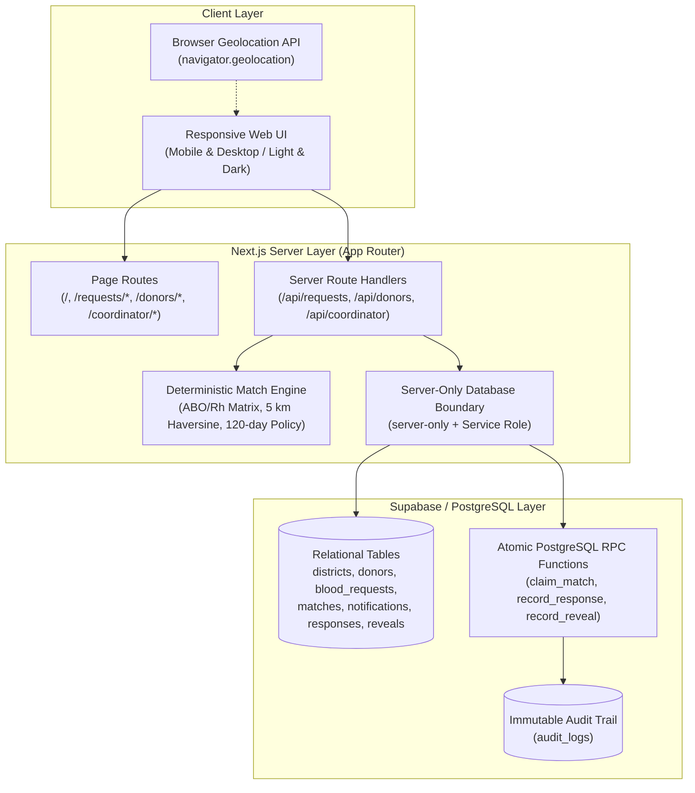

# Hemo Match

> A privacy-first district blood donor coordination system.

[](https://hemomatch.vercel.app/)
[](https://hemomatch.vercel.app/)
[](https://github.com/rohanmgeorgeo/hemo-match)
[](https://www.typescriptlang.org/)
[](https://nextjs.org/)
[](https://tailwindcss.com/)
[](https://supabase.com/)

---

## Quick Links

- **Live Demo**: [https://hemomatch.vercel.app/](https://hemomatch.vercel.app/)
- **Challenge**: SC-12 — District Blood Donor Matching
- **Status**: Functional hackathon / selection prototype

---

## The Problem

In medical emergencies, blood requests are frequently forwarded across unmoderated WhatsApp groups, Telegram channels, and social media feeds. This broadcast model introduces critical failure modes:

1. **Information Noise & Donor Fatigue**: Urgent messages reach thousands of individuals who are incompatible, too far away, recently donated, or unavailable. Over time, broadcast fatigue causes eligible donors to mute group notifications.
2. **Severe Privacy Loss**: Patient medical details and donor phone numbers spread publicly and indefinitely across open chat logs, leaving donors vulnerable to unsolicited calls and data harvesting.
3. **Coordination Chaos**: Requesters have zero visibility into who received the message, who is on their way, or whether the requirement has already been met—often resulting in either zero donors or multiple donors arriving unexpectedly.

---

## The Solution

**Hemo Match** is a privacy-first district blood donor coordination platform built for emergency healthcare scenarios. It replaces indiscriminate public broadcasts with an authoritative, server-driven matching engine that evaluates ABO/Rh biological compatibility, strict donation rest intervals, and real-time physical proximity within 5 km (with same-district fallback). Crucially, Hemo Match safeguards donor privacy by keeping personal phone numbers and identities completely concealed throughout the matching, notification, and acceptance stages—exposing contact details only through an explicit, requester-authorized reveal action backed by atomic database transactions and an immutable audit trail.

---

## Core Workflow

Hemo Match enforces a strict 5-stage coordination pipeline designed around privacy and accountability:

```
Request ──► Match ──► Notify ──► Accept ──► Reveal Contact
```

1. **Request**: A hospital or patient representative submits an emergency requirement specifying blood group, units, required-by timestamp, district, hospital, and optional coordinates.
2. **Match**: The server-authoritative matching engine deterministically filters candidate donors against biological compatibility, a conservative 120-day interval policy, and physical proximity.
3. **Notify**: Targeted in-app alerts are dispatched to matched candidate donors with atomic idempotency and duplicate prevention.
4. **Accept**: Donors review request details (urgency, hospital area, required-by time) in their private in-app inbox and authoritatively record `Accept` or `Decline`.
5. **Reveal Contact**: Donor phone numbers remain strictly masked through matching and acceptance. Only after explicit requester authorization is minimum coordination contact (name and phone) revealed, with non-PII audit logging.

---

## Key Features

- **Blood Request Intake**: Structured request submission capturing patient blood group, required units, urgency tier (`standard`, `urgent`, `critical`), required-by timestamp, and hospital location.
- **Donor Registration & Profiles**: Volunteer donor registration with blood group, administrative district, optional coordinates, availability toggle, consent controls, and notification preferences.
- **ABO/Rh Biological Compatibility**: Server-side 64-pair biological compatibility matrix supporting Whole Blood and Red Blood Cells (RBC).
- **Conservative 120-Day Donation Interval Policy**: Application-level rest interval verification safeguarding donor health between donations.
- **Coordinate-First Proximity Matching**: High-precision straight-line distance calculations using the Haversine formula when requester and donor coordinates are available.
- **5 km Application Radius**: Focused local matching boundary to ensure rapid emergency physical transit.
- **Same-District Fallback**: Graceful fallback matching donors within the same administrative district when coordinates are unavailable.
- **Deterministic 4-Tier Ranking**: Rigorous, reproducible candidate prioritization (Homologous match → Measured proximity → Rest interval → UUID tie-breaker).
- **Targeted In-App Notifications**: Focused alerts delivered directly to eligible donor inboxes without public broadcasts.
- **Duplicate Notification Protection**: Database-level partial unique indexes and atomic PostgreSQL RPC functions preventing duplicate dispatches.
- **Donor Accept / Decline Workflow**: Authoritative response recording with server-side pre-response revalidation.
- **Explicit Authorized Contact Reveal**: Two-step privacy gate requiring verified donor acceptance and explicit requester authorization to view donor contact details.
- **Immutable Audit Trail**: Append-only security and operational audit log tracking all status transitions, notifications, responses, and reveal events.
- **Coordinator Operations Dashboard**: Read-only system overview (`/coordinator` and `/coordinator/requests/[id]`) providing district health coordinators with aggregate metrics, 4-stage pipeline summaries, and anonymized candidate projections.
- **Responsive Web UI**: Accessible on both mobile and desktop viewports with seamless Light and Dark theme support.
- **Internal Selection Dataset Tooling**: Developer-only deterministic seeding scripts (`scripts/seed-selection.ts`) for repeatable evaluation runs.

---

## Privacy by Design

Privacy is not an add-on in Hemo Match; it is the core architectural boundary:

- **Donor Phone Numbers Never Exposed in Matching**: The matching engine operates entirely on internal identifiers. Candidate donor lists and match query results never contain phone numbers, email addresses, or full names.
- **Acceptance Alone Does Not Reveal Contact**: When a donor accepts a notification, their contact information remains locked. It is not automatically displayed to the requester.
- **Explicit Authorized Reveal Required**: Contact information is unlocked only when the requester explicitly clicks "Reveal Contact" for an accepted donor. This action invokes an atomic PostgreSQL RPC (`record_contact_reveal`) that validates request state, logs the event, and returns only the minimum required coordination fields (name and phone).
- **Anonymized Coordinator Projections**: The district coordinator dashboard displays donors strictly as sanitized reference tokens (e.g., `Donor •••• 0001`). Coordinators cannot view donor phone numbers or force contact reveals.
- **Zero Requester-Facing Coordinates**: Requesters never receive raw donor latitude or longitude; only computed straight-line proximity or district confirmation.
- **Server-Side Security Boundary**: All database operations utilizing elevated service privileges (`SUPABASE_SERVICE_ROLE_KEY`) are strictly restricted behind Next.js server-only boundaries (`import "server-only"`). The public Supabase client (`anon` key) is denied direct access to sensitive tables via PostgreSQL Row-Level Security.

---

## Matching Logic

The Hemo Match matching engine applies a deterministic, multi-stage evaluation pipeline to ensure fair, reproducible, and clinically safe candidate selection:

```
Candidate Donors in District
        │
        ▼ 1. ABO/Rh Compatibility (Authoritative RBC matrix)
        │
        ▼ 2. Availability & Consent (is_available = true, consent = true)
        │
        ▼ 3. 120-Day Donation Interval Policy (elapsed_days >= 120)
        │
        ▼ 4. Location Filtering (5 km Haversine radius OR same-district fallback)
        │
        ▼ 5. De-duplication (filter existing notifications & responses)
        │
        ▼ 6. Deterministic 4-Tier Ranking
        │      ├── Tier 1: Homologous ABO/Rh Match First (exact match over compatible)
        │      ├── Tier 2: Physical Proximity (nearer distance ranks higher)
        │      ├── Tier 3: Rest Interval (greater elapsed rest days ranks higher)
        │      └── Tier 4: UUID Lexicographical Tie-Breaker
        ▼
Ranked Candidate Matches
```

### Application Policy & Clinical Boundaries

> **Important Policy Statement**:
> "The 120-day interval is Hemo Match's conservative application matching policy for this MVP. It is not a universal medical eligibility rule. Final donor eligibility is determined by qualified blood-bank/clinical personnel."

- **Supported Components**: Current matching logic supports **Whole Blood** and **Red Blood Cells (RBC)** only. Platelet and plasma matching are not supported in this version.
- **Clinical Non-Interference**: Hemo Match serves as a discovery and coordination tool. It does **not** determine clinical suitability, perform crossmatching, or replace qualified medical screening.

---

## Architecture



---

## Tech Stack

- **Framework**: [Next.js](https://nextjs.org/) 16.3.5 (App Router, Server Components, Route Handlers)
- **Runtime**: [Node.js](https://nodejs.org/) (Engine 20+) & [React](https://react.dev/) 19.2.8
- **Language**: [TypeScript](https://www.typescriptlang.org/) 5 (strict type-checking enabled)
- **Styling & Design System**: [Tailwind CSS](https://tailwindcss.com/) 4 with CSS variables for dynamic dark/light themes
- **Database**: [Supabase](https://supabase.com/) / [PostgreSQL](https://www.postgresql.org/) (Enums, Constraints, Partial Unique Indexes, Atomic PL/pgSQL RPCs)
- **Database Client**: `@supabase/supabase-js` 2.116.0
- **Server Guard**: `server-only` 0.0.1
- **Hosting & Deployment**: [Vercel](https://vercel.com/) (Edge network, automated CI/CD)
- **Geolocation**: Browser Geolocation API & pure Haversine distance algorithm
- **Test Framework**: Node.js Native Test Runner via `tsx` 4.23.13 (`tsx --test`)

---

## Screenshots / Visual Walkthrough

> *Screenshots capture the core user flows while strictly protecting donor personal data.*

| View | Route | Description |
| :--- | :--- | :--- |
| **Emergency Blood Request** | `/requests/new` | Structured request intake with urgency level, required units, hospital details, and optional location capture. |
| **Candidate Matching & Dispatch** | `/requests/matching-demo` | Ranked candidate cards displaying ABO compatibility, distance, and 120-day interval status with one-click dispatch. |
| **Donor Notification Inbox** | `/donors/notifications` | Private inbox displaying incoming emergency alerts with request urgency, hospital area, and Accept / Decline actions. |
| **Authorized Contact Reveal** | `/requests/matching-demo` | Explicit requester authorization reveal showing minimum coordination contact (name and phone) for accepted donors only. |
| **Coordinator Operations Dashboard** | `/coordinator` | System-level operational overview featuring real-time metrics, active request filters, and deterministic attention alerts. |
| **Coordinator Request Lifecycle** | `/coordinator/requests/[id]` | 4-stage operational pipeline cards, 5-step lifecycle timeline, and anonymized candidate roster (`Donor •••• XXXX`). |

---

## Coordinator Dashboard

The Coordinator Operations Dashboard (`/coordinator` and `/coordinator/requests/[id]`) provides district health coordinators and emergency monitors with system-level operational oversight without compromising privacy:

- **Read-Only Scope**: The dashboard performs zero database mutations. Coordinators cannot delete records, edit donor information, or bypass the privacy reveal protocol.
- **Aggregate Metrics**: Real-time operational cards displaying Active Requests (`status IN (active, notified)`), Needs Attention, Dispatched Alerts, Accepted Donors, and Contact Reveals.
- **Deterministic Attention Alerts**: A request is flagged for coordinator attention based strictly on verifiable database states:
  - Zero eligible candidates discovered for an active request
  - Awaiting donor acceptance on notified requests
  - Past required-by deadline without fulfillment
  - Request expired unfulfilled
- **Privacy-Safe Projections**: Donors are represented exclusively by masked identifiers (`Donor •••• XXXX`). Phone numbers and exact coordinates are strictly omitted from coordinator API payloads.

---

## Database / Data Model

Hemo Match utilizes an 8-table relational PostgreSQL schema designed for strict referential integrity and transactional safety:

- **`districts`**: Administrative district reference data with centroid coordinates and active status.
- **`donors`**: Volunteer donor profiles, blood groups, administrative district, optional coordinates, rest interval dates, availability toggle, consent, and notification preferences.
- **`blood_requests`**: Emergency blood requests specifying blood group, units, urgency, required-by timestamp, hospital details, coordinates, and lifecycle status (`draft`, `active`, `notified`, `fulfilled`, `cancelled`, `expired`).
- **`matches`**: Candidate associations linking requests to compatible donors, recording ranking metadata and match status (`candidate`, `notified`, `accepted`, `declined`, `expired`).
- **`notifications`**: In-app alerts dispatched to donors with atomic claiming, idempotency constraints, and read tracking.
- **`donor_responses`**: Immutable donor response records capturing `accepted` or `declined` decisions with timestamp and optional notes.
- **`contact_reveals`**: Authorized contact reveal records created only upon explicit requester action for accepted donors.
- **`audit_logs`**: Append-only security and operational audit trail recording entity lifecycle events, status changes, and reveal actions (without storing PII).

---

## Running Locally

### Prerequisites

- [Node.js](https://nodejs.org/) version 20.0.0 or higher
- [npm](https://www.npmjs.com/) version 10.0.0 or higher
- A [Supabase](https://supabase.com/) project with PostgreSQL

### 1. Clone the Repository

```bash
git clone https://github.com/rohanmgeorgeo/hemo-match.git
cd hemo-match
```

### 2. Install Dependencies

```bash
npm install
```

### 3. Configure Environment Variables

Copy the provided example environment template:

```bash
cp .env.example .env.local
```

Open `.env.local` and provide your Supabase project credentials:

```env
# Public / Browser-Safe Variables
NEXT_PUBLIC_SUPABASE_URL=https://your-project-id.supabase.co
NEXT_PUBLIC_SUPABASE_ANON_KEY=your-anon-key-placeholder

# Server-Only / Private Variables (NEVER expose to browser)
SUPABASE_SERVICE_ROLE_KEY=your-service-role-key-placeholder

# Application Base URL
NEXT_PUBLIC_APP_URL=http://localhost:3000
```

> **Security Note**: Never commit `.env.local` or real secret keys to source control. `.env.local` is excluded in `.gitignore`.

### 4. Database Setup

Apply the sequential migrations located in `migrations/` using the Supabase SQL Editor or Supabase CLI:

- `migrations/0001_initial_schema.sql` — Core tables, enums, constraints, and RLS policies
- `migrations/0002_notification_idempotency.sql` — Partial unique indexes for dispatch idempotency
- `migrations/0003_atomic_notification_dispatch.sql` — Atomic `claim_match_and_create_notification` RPC
- `migrations/0004_atomic_donor_response.sql` — Atomic `record_donor_response` RPC
- `migrations/0005_contact_reveal_authorization.sql` — Atomic `record_contact_reveal` RPC

### 5. Start the Development Server

```bash
npm run dev
```

Open [http://localhost:3000](http://localhost:3000) in your browser to access Hemo Match.

---

## Testing

The project includes an automated test suite executed via the native Node.js test runner:

```bash
npm test
```

### Verified Test Results

- **Test Count**: **259 passing tests**
- **Suite Count**: **76 passing test suites**
- **Failures / Regressions**: **0**

The automated test suite comprehensively verifies:
- ABO/Rh biological compatibility matrix (64 pair combinations)
- Conservative 120-day donation interval calculation and policy enforcement
- Coordinate-first proximity calculations (Haversine formula within 5 km)
- Graceful same-district fallback logic when coordinates are absent
- Deterministic 4-tier candidate ranking and lexicographical tie-breaking
- Dispatch idempotency and duplicate notification prevention
- Atomic donor response recording and state revalidation
- Requester contact reveal authorization and minimum projection rules
- Coordinator operations overview and request detail data projections
- Server-side validation schemas and error handling

### Additional Code Quality Checks

```bash
# Run TypeScript typecheck
npm run typecheck

# Run ESLint validation
npm run lint

# Run production build
npm run build
```

---

## Selection Dataset

For controlled, repeatable evaluation and demonstrations, an internal developer utility is included:

```bash
# Seed deterministic evaluation donors in Ernakulam district
npm run seed:selection

# Safely reset evaluation donor records
npm run seed:selection:reset
```

> **Note**: This is strictly internal developer tooling designed for evaluation verification. It does not introduce a public "Demo Mode" toggle or alter the production matching engine logic.

---

## Current MVP Boundaries

To maintain transparency and clinical credibility, the following boundaries of the current MVP are documented:

- **Authentication**: The MVP does not yet feature production SMS OTP authentication or user logins; navigation and view states use direct routes and local session caching.
- **Coordinator RBAC**: The Coordinator Dashboard is an operational prototype; enterprise role-based access control (RBAC) and healthcare SSO are planned for production.
- **Notification Channels**: Notifications are currently delivered via the in-app notification inbox. Outbound SMS and WhatsApp messaging gateways are not yet connected.
- **Blood Component Scope**: Matching is limited to **Whole Blood** and **Red Blood Cells (RBC)**. Platelet and plasma matching are not supported in this version.
- **Inventory Integration**: Hemo Match does not connect directly to blood bank physical storage or hospital Laboratory Information Systems (LIS).
- **Clinical Suitability**: The system coordinates donor discovery only; biological crossmatching and clinical screening must always be conducted by qualified medical staff.
- **Location Input**: Location capture currently utilizes the Browser Geolocation API; full hospital address autocomplete and place search are roadmap items.

---

## Roadmap

- **Authentication & RBAC**: Supabase Auth integration with SMS OTP verification for donors and role-based access control for health coordinators.
- **Verified Organization Accounts**: Dedicated onboarding and credentialing for accredited hospitals, clinics, and licensed blood banks.
- **Outbound Notification Gateways**: SMS and WhatsApp notification delivery via enterprise messaging APIs (e.g., Twilio, Gupshup).
- **Staged Notification Escalation**: Intelligent batching to notify the nearest N donors first, automatically expanding notification radius if requests remain unfilled.
- **Hospital Place Search**: Integration with mapping and place autocomplete APIs for intuitive hospital location selection.
- **Multilingual Support**: Localization into Malayalam and other regional languages.
- **Inventory & LIS Integration**: Bi-directional integration with district blood-bank inventory management systems.

---

## Responsible Use / Medical Disclaimer

**Hemo Match is a donor discovery and coordination aid only.**

It is not a clinical diagnostic system, medical device, or blood-testing platform. Final donor eligibility, biological crossmatching, transfusion safety verification, and deferral determinations belong strictly to qualified medical officers and licensed blood-bank personnel in accordance with national transfusion guidelines.

---

## Team

**Hack Wheels**

- **Rohan M George** — JAIN (Deemed-to-be University), Kochi / School of Future
- **Diya Starmon** — JAIN (Deemed-to-be University), Kochi / School of Future

---

## Development / AI Tooling

Development was assisted using Antigravity/Gemini and ChatGPT for implementation support, debugging, planning, QA and documentation.

AI is **NOT** used by Hemo Match to make donor eligibility or clinical matching decisions. All matching, ranking, and filtering operations are performed by deterministic, auditable application logic.
