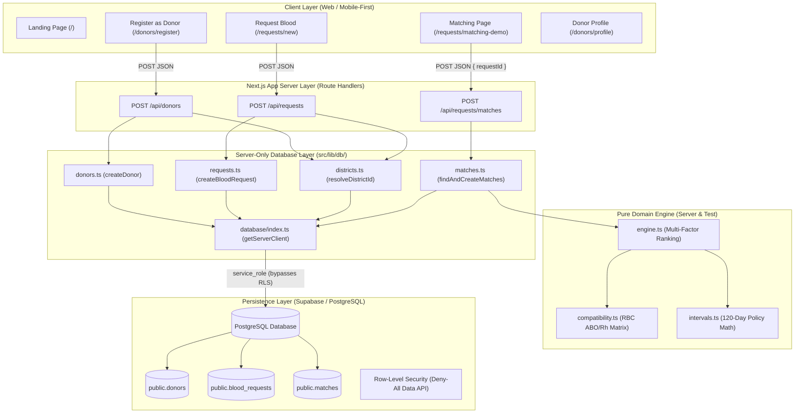

# Hemo Match System Architecture

**Project:** Hemo Match
**Challenge:** SC-12 — District Blood Donor Matching
**Status:** Request → Match Milestone Complete (Step 6)

---

## 1. High-Level System Overview

**Hemo Match** connects verified blood donors with urgent patient requirements at the district level. The architecture prioritizes rapid matching, strict preliminary eligibility safety, and privacy-first contact reveal protocols.



---

## 2. Directory Structure & Modular Layout

```
Hemo Match/
├── docs/                      # Architectural & progress documentation
│   ├── PROJECT_STATUS.md      # Current milestone status, handoff, and tasks
│   ├── ARCHITECTURE.md        # System architecture & module contracts (this file)
│   ├── DECISIONS.md           # Architectural Decision Records (ADRs)
│   ├── TODO.md                # Task tracking across milestones
│   ├── BUGS.md                # Known issues, limitations, and mitigations
│   └── DEMO.md                # End-to-end demo script and verification flow
├── supabase/
│   └── migrations/
│       └── 0001_initial_schema.sql   # PostgreSQL schema + RLS + Data API privileges
├── src/
│   ├── app/                   # Next.js App Router
│   │   ├── api/               # Dynamic Route Handlers (Server Boundary)
│   │   │   ├── donors/route.ts          # POST /api/donors (donor intake)
│   │   │   ├── requests/route.ts        # POST /api/requests (blood request intake)
│   │   │   └── requests/matches/route.ts# POST /api/requests/matches (match engine)
│   │   ├── requests/
│   │   │   ├── new/page.tsx             # Blood request intake form
│   │   │   └── matching-demo/page.tsx   # Request matching UI (connected to API)
│   │   └── donors/
│   │       ├── register/page.tsx        # Donor registration form
│   │       └── profile/page.tsx         # Donor profile confirmation view (masked phone)
│   ├── lib/                   # Isolated subsystem contracts & utilities
│   │   ├── db/                # Server-only database helper modules ('server-only')
│   │   │   ├── districts.ts   # Slug-to-UUID resolver
│   │   │   ├── donors.ts      # createDonor() database helper
│   │   │   ├── requests.ts    # createBloodRequest() database helper
│   │   │   └── matches.ts     # findAndCreateMatches() server-only coordinator
│   │   ├── database/index.ts  # Supabase client factory (server-only)
│   │   ├── validation/        # Schema validators, IST date parser, and UUID guards
│   │   │   ├── index.ts       # Donor & request form validators
│   │   │   └── matches.ts     # Match body RFC 4122 UUID validator
│   │   ├── matching/          # Core matching engine & pure algorithms
│   │   │   ├── compatibility.ts # RBC ABO/Rh 64-pair biological matrix
│   │   │   ├── engine.ts        # Pure multi-factor ranking & exclusion engine
│   │   │   └── ui-helpers.ts    # Frontend storage validation & API response parsing
│   │   ├── eligibility/       # Preliminary donation interval subsystem
│   │   │   ├── intervals.ts   # Timezone-independent calendar math (120-day policy)
│   │   │   └── rules.ts       # Configurable interval rule definitions
│   │   ├── privacy/           # Phone masking & 2-way contact reveal (Step 9)
│   │   └── notifications/     # In-app notification queue & alerts (Step 7)
│   └── types/
│       ├── index.ts           # Shared frontend domain types
│       ├── matches.ts         # Privacy-safe match candidates & API response types
│       └── database.ts        # Database row & insert types (server-side, snake_case)
└── tests/                     # 90 automated tests across domain and UI logic
    ├── compatibility.test.ts  # RBC 64-pair biological compatibility tests
    ├── intervals.test.ts      # Preliminary donation interval evaluation tests
    ├── engine.test.ts         # Pure matching engine, filters, ranking, and privacy tests
    ├── matches.route.test.ts  # Route validation & HTTP status mapping tests
    └── matching-ui.test.ts    # Frontend UI helpers & privacy assertions
```

---

## 3. End-to-End Request → Match Flow

The implemented Request → Match flow executes across five discrete layers:

```
1. Request Intake:
   User submits form at /requests/new
   → Validated server-side via POST /api/requests
   → Inserted into public.blood_requests
   → Authoritative PostgreSQL UUID returned in HTTP 201 response
   → Cached in browser localStorage (hemo_match_active_request) for view handoff

2. Match Discovery Request:
   /requests/matching-demo reads cached request
   → Validates RFC 4122 UUID via validateStoredRequest()
   → Calls POST /api/requests/matches with { "requestId": "<uuid>" }

3. Server Boundary & Database Coordinator:
   POST /api/requests/matches validates UUID format
   → Delegates to server-only findAndCreateMatches() in src/lib/db/matches.ts
   → Queries blood_requests by ID using getServerClient() (service_role)
   → Pre-checks request state (active, supported component, unexpired)
   → Queries registered donors in the same district (excluding phone and name)
   → Queries existing matches to prevent duplicate evaluations

4. Pure Domain Matching & Ranking:
   findAndCreateMatches() converts DB rows to engine inputs
   → Invokes pure matchDonorsForRequest() in src/lib/matching/engine.ts
   → Evaluates biological RBC ABO/Rh compatibility (Whole Blood & RBC only)
   → Evaluates 120-day preliminary recovery interval using UTC midnight normalization
   → Enforces hard exclusions: unavailability, consent false, different district, unknown history
   → Sorts candidates deterministically:
     Tier 1: Homologous exact ABO/Rh matches
     Tier 2: Compatible alternative ABO/Rh matches
     Within tier: Greater elapsed recovery days
     Tie-break: Lexicographic donor UUID (internal only)

5. Idempotent Persistence & Privacy-Safe Response:
   New candidate records inserted into public.matches via upsert with onConflict + ignoreDuplicates
   → Guarded by database UNIQUE(request_id, donor_id) constraint
   → Non-PII match_metadata recorded (biological factors and evaluated date only)
   → Sanitized PublicMatchCandidate[] returned to browser with anonymized references
   → Rendered in matching-demo UI as clean candidate cards
```

---

## 4. Security & Privacy Architecture

### A. Secret & Database Isolation
- **Service-Role Client**: Authenticated via `SUPABASE_SERVICE_ROLE_KEY` solely inside server-only modules guarded by `import 'server-only'`.
- **Zero Client Credential Leakage**: The browser never receives, requests, or uses `SUPABASE_SERVICE_ROLE_KEY`.
- **Zero Direct Browser Queries**: The client never queries Supabase tables directly; all operations pass through Next.js Route Handlers.
- **Data API Least Privilege**: `anon` and `authenticated` PostgREST roles are granted `SELECT` on `public.districts` only. Data API access to `donors`, `blood_requests`, and `matches` is completely denied by table-level RLS and privilege revocations.

### B. Donor Privacy in Public Matching
- **No Donor Identification Before Acceptance**: Donor full names, phone numbers, email addresses, and raw donor UUIDs are strictly stripped from all matching projections.
- **Anonymized References**: Candidate cards display non-identifying identifiers derived from the UUID suffix (e.g. `Donor •••• 9B4F`).
- **Internal Tie-Break Only**: The internal tie-break donor UUID is used strictly in-memory during sorting and is never persisted in `match_metadata` or returned to API consumers.
- **Internal Exclusions Protected**: Disqualification codes (e.g., `EXCLUDE_INTERVAL_TOO_SHORT`, `EXCLUDE_NO_CONSENT`) are internal to the engine and never returned over public endpoints.

---

## 5. Clinical Safety Boundary

> [!WARNING]
> **Preliminary Donor Discovery Only**:
> Hemo Match performs preliminary algorithmic donor discovery and coordination only.
> It does **NOT** determine final clinical eligibility, transfusion compatibility, or medical clearance.
> All blood collection, donor screening, deferral determination, and crossmatching must be conducted by qualified medical officers and licensed blood-bank personnel in accordance with national transfusion guidelines.
