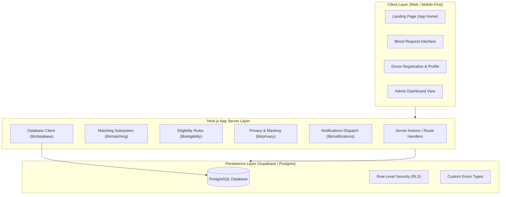

# Hemo Match System Architecture

**Project:** Hemo Match  
**Challenge:** SC-12 — District Blood Donor Matching  
**Status:** Database Foundation Established (Milestone 4)  

---

## 1. High-Level System Overview

**Hemo Match** is designed to connect verified blood donors with urgent patient requirements at the district level. The architecture prioritizes rapid matching, strict donor medical eligibility, and privacy-first contact reveal protocols.



> [!NOTE]
> **Current phase:** Database foundation (Step 4) is complete. The schema, enums, indexes, RLS policies, and typed Supabase clients are in place. The existing localStorage-based frontend flows remain unchanged. Wiring the UI to real database persistence is deferred to the next milestone.

---

## 2. Directory Structure & Modular Layout

```
Hemo Match/
├── docs/                      # Architectural & progress documentation
│   ├── PROJECT_STATUS.md      # Current build state, handoff, and tasks
│   ├── ARCHITECTURE.md        # System design & module contracts (this file)
│   └── DECISIONS.md           # Architectural Decision Records (ADRs)
├── supabase/
│   └── migrations/
│       └── 0001_initial_schema.sql   # Initial Supabase/PostgreSQL schema
├── src/
│   ├── app/                   # Next.js App Router (pages, layouts, styles)
│   │   ├── favicon.ico
│   │   ├── globals.css        # Global CSS & Tailwind theme tokens
│   │   ├── layout.tsx         # Root layout with typography & metadata
│   │   ├── page.tsx           # Landing page
│   │   ├── requests/
│   │   │   ├── new/           # Blood request intake form
│   │   │   └── matching-demo/ # Post-submission matching summary
│   │   └── donors/
│   │       ├── register/      # Donor registration form
│   │       └── profile/       # Donor profile confirmation view
│   ├── lib/                   # Isolated subsystem contracts & utilities
│   │   ├── matching/          # District matching algorithms & filters (stubbed)
│   │   ├── eligibility/       # Donor interval & medical health checks (stubbed)
│   │   ├── privacy/           # Phone masking & 2-way contact reveal (stubbed)
│   │   ├── notifications/     # In-app notification queue & alerts (stubbed)
│   │   ├── database/          # Supabase client factory & helpers (implemented)
│   │   └── validation/        # Schema validators & input guards (implemented)
│   └── types/
│       ├── index.ts           # Frontend domain types (form state, localStorage)
│       └── database.ts        # Database row types (server-side, snake_case)
├── public/                    # Static brand assets
├── .env.example               # Safe environment variable template
├── next.config.ts             # Next.js framework configuration
├── tsconfig.json              # Strict TypeScript compiler options
└── package.json               # Dependencies and scripts
```

---

## 3. Database Schema

### 3.1 Tables & Relationships

```
districts
  ↑ referenced by donors.district_id
  ↑ referenced by blood_requests.district_id

donors ──────────────────────────────────────────────────────────────────┐
  ↑ referenced by matches.donor_id                                       │
  ↑ referenced by donor_responses.donor_id                               │
  ↑ referenced by notifications.donor_id                                 │
  ↑ referenced by contact_reveals.donor_id                               │

blood_requests ──────────────────────────────────────────────────────────┤
  ↑ referenced by matches.request_id                                     │
  ↑ referenced by donor_responses.request_id                             │
  ↑ referenced by notifications.request_id                               │
  ↑ referenced by contact_reveals.request_id                             │

matches                                                                   │
  → donors, blood_requests                                                │
  ↑ referenced by donor_responses.match_id                               │
  ↑ referenced by notifications.match_id                                 │
  ↑ referenced by contact_reveals.match_id                               │

donor_responses   → matches, donors, blood_requests                      │
notifications     → donors, blood_requests, matches                      │
contact_reveals   → donors, blood_requests, matches (IMMUTABLE LOG)      │
audit_logs        → standalone append-only log ─────────────────────────┘
```

### 3.2 Table Summary

| Table | Purpose |
| :--- | :--- |
| `districts` | Reference lookup for administrative districts (public read) |
| `donors` | Donor profiles (private — phone_number server-only) |
| `blood_requests` | Blood requirement intake records (no patient PII) |
| `matches` | Matching engine output: request ↔ donor pairings |
| `donor_responses` | Donor accept/decline responses to match notifications |
| `notifications` | In-app notification feed records |
| `contact_reveals` | **Immutable** audit log of every contact reveal event |
| `audit_logs` | **Append-only** general privacy/security action audit log |

### 3.3 Custom Enum Types

| Enum | Values |
| :--- | :--- |
| `blood_group` | A+, A-, B+, B-, AB+, AB-, O+, O- |
| `blood_component` | Whole Blood, Red Blood Cells, Platelets, Plasma |
| `urgency_level` | critical, urgent, routine, standard |
| `request_status` | draft, active, matching, notified, partially_filled, fulfilled, expired, cancelled |
| `donor_availability` | available, temporarily_unavailable, paused |
| `notification_preference` | enabled, disabled |
| `match_status` | candidate, notified, responded, accepted, declined, withdrawn, expired |
| `response_status` | accepted, declined, pending |
| `notification_status` | unread, read, dismissed |
| `notification_type` | match_found, request_fulfilled, request_expired, contact_reveal, system |

### 3.4 Privacy-Critical Design Decisions

- **`donors.phone_number`** — stored in the `donors` table but never returned in anon-key queries (no permissive RLS policy). It is only surfaced through the `contact_reveals` workflow using the `SUPABASE_SERVICE_ROLE_KEY`.
- **No exact addresses** — `donors.approximate_area` and `blood_requests.approximate_area` store neighbourhood/locality strings only.
- **No patient PII** — `blood_requests` has no `patient_name`, `patient_phone`, or `patient_email` columns.
- **`contact_reveals` is append-only** — the `Update` type for this table is `never` in the TypeScript `Database` interface.
- **`audit_logs` is append-only** — same `never` pattern.

---

## 4. Supabase Client Architecture

Two distinct clients exist in `src/lib/database/index.ts`:

| Client | Function | Key Used | RLS | Use Context |
| :--- | :--- | :--- | :--- | :--- |
| Server | `getServerClient()` | `SUPABASE_SERVICE_ROLE_KEY` | Bypassed | Route Handlers, Server Actions only |
| Anon | `getAnonClient()` | `NEXT_PUBLIC_SUPABASE_ANON_KEY` | Enforced | Server Components, public reference reads |

**Rule:** `getServerClient()` must never be called from a `'use client'` component. The service-role key is never bundled into the client-side JavaScript.

---

## 5. Row Level Security Model

| Table | Anon Select | Anon Insert/Update | Service Role |
| :--- | :--- | :--- | :--- |
| `districts` | ✅ Public read | ❌ | ✅ Full access |
| `donors` | ❌ Denied | ❌ | ✅ Full access |
| `blood_requests` | ❌ Denied | ❌ | ✅ Full access |
| `matches` | ❌ Denied | ❌ | ✅ Full access |
| `donor_responses` | ❌ Denied | ❌ | ✅ Full access |
| `notifications` | ❌ Denied | ❌ | ✅ Full access |
| `contact_reveals` | ❌ Denied | ❌ | ✅ Full access |
| `audit_logs` | ❌ Denied | ❌ | ✅ Full access |

> [!IMPORTANT]
> This is the **mock-auth phase** RLS model. All protected tables are locked to anon access to prevent accidental exposure of `donors.phone_number`. When real authentication (Supabase Auth / OTP) is integrated, add `auth.uid()`-scoped policies to allow donors to read/update their own rows.

---

## 6. Subsystem Boundaries & Responsibilities

### 6.1 Donor Management
* **Planned Responsibility:** Donor onboarding, availability toggling, donation history tracking, and district assignment.
* **Current State:** Registration form complete (Step 3), domain types implemented, database schema established. Not yet wired to Supabase persistence.

### 6.2 Blood Requests
* **Planned Responsibility:** Intake for emergency blood requirements.
* **Current State:** Request form complete (Step 2), database schema established. Not yet wired to Supabase persistence.

### 6.3 Matching Subsystem (`src/lib/matching/`)
* **Planned Responsibility:** Queries active eligible donors in district/neighboring districts matching compatible blood groups.
* **Current State:** Stubs defined. Schema tables (`matches`) ready.

### 6.4 Eligibility Rules Subsystem (`src/lib/eligibility/`)
* **Planned Responsibility:** Enforces minimum donation intervals, age/weight criteria, and temporary deferrals.
* **Current State:** Stubs defined. Eligibility is NOT encoded in the database — it is a runtime matching-stage concern.

### 6.5 Privacy & Contact Reveal Subsystem (`src/lib/privacy/`)
* **Planned Responsibility:** Masking and explicit contact reveal workflow.
* **Current State:** Phone masking implemented in the profile view. `contact_reveals` table established. Full workflow deferred.

### 6.6 Notifications Subsystem (`src/lib/notifications/`)
* **Planned Responsibility:** In-app notification feed, future SMS/WhatsApp integration.
* **Current State:** `notifications` table established. Dispatcher stubbed.

### 6.7 Database Subsystem (`src/lib/database/`)
* **Current State:** Fully implemented.
  - `getServerClient()` — service role, bypasses RLS.
  - `getAnonClient()` — anon key, respects RLS.
  - `getDatabaseConfig()` — environment readiness check.

### 6.8 Admin Dashboard
* **Planned Responsibility:** District-level oversight, audit log access, donor activity metrics.
* **Current State:** Reserved. `audit_logs` table established.

---

## 7. Environment Variables

| Variable | Prefix | Where Used | Required |
| :--- | :--- | :--- | :--- |
| `NEXT_PUBLIC_SUPABASE_URL` | Public | Client + Server | Yes |
| `NEXT_PUBLIC_SUPABASE_ANON_KEY` | Public | Client + Server | Yes |
| `SUPABASE_SERVICE_ROLE_KEY` | Private | Server only | For server mutations |
| `NEXT_PUBLIC_APP_URL` | Public | Absolute URL generation | Optional |

---

## 8. Design System & Aesthetics Guidelines

The UI follows an **Apple Health & Modern Fintech** inspired visual design:
* **Background & Elevation:** Crisp, neutral canvas (`#FFFFFF` / `#FAFAFA`) with subtle surface elevations.
* **Accents:** Restrained crimson/rose tones (`rose-600` / `#E11D48`) for emergency signals and primary actions.
* **Containers:** Generously rounded cards (`rounded-2xl` to `rounded-3xl`) with hairline borders.
* **Typography:** System fonts / Geist Sans with accessible type hierarchy.
* **Responsive Paradigm:** Mobile-first layout with single-thumb accessibility.
