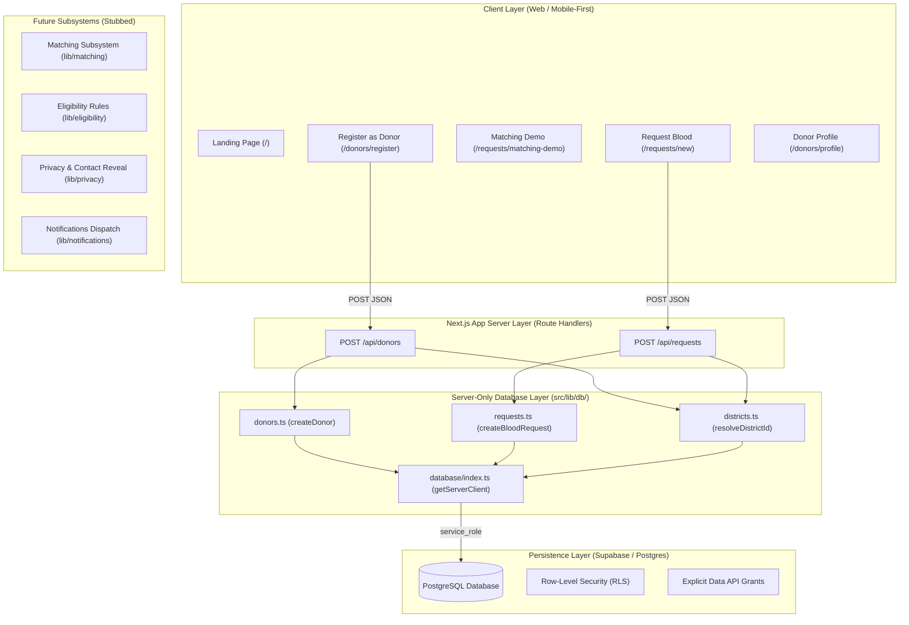

# Hemo Match System Architecture

**Project:** Hemo Match  
**Challenge:** SC-12 — District Blood Donor Matching  
**Status:** Database Foundation & Persistence Wiring Complete (Milestone 5)  

---

## 1. High-Level System Overview

**Hemo Match** connects verified blood donors with urgent patient requirements at the district level. The architecture prioritizes rapid matching, strict donor clinical eligibility, and privacy-first contact reveal protocols.



---

## 2. Directory Structure & Modular Layout

```
Hemo Match/
├── docs/                      # Architectural & progress documentation
│   ├── PROJECT_STATUS.md      # Current build state, handoff, and tasks
│   ├── ARCHITECTURE.md        # System design & module contracts (this file)
│   └── DECISIONS.md           # Architectural Decision Records (ADRs)
├── supabase/
│   └── migrations/
│       └── 0001_initial_schema.sql   # PostgreSQL schema + RLS + Data API privileges
├── src/
│   ├── app/                   # Next.js App Router (pages, layouts, styles, APIs)
│   │   ├── api/               # Dynamic Route Handlers (Server Boundary)
│   │   │   ├── donors/route.ts       # POST /api/donors (donor intake)
│   │   │   └── requests/route.ts     # POST /api/requests (blood request intake)
│   │   ├── requests/
│   │   │   ├── new/page.tsx          # Blood request intake form
│   │   │   └── matching-demo/page.tsx# Matching demo view (drives from local cache)
│   │   └── donors/
│   │       ├── register/page.tsx     # Donor registration form
│   │       └── profile/page.tsx      # Donor profile confirmation view (masked phone)
│   ├── lib/                   # Isolated subsystem contracts & utilities
│   │   ├── db/                # Server-only database helper modules
│   │   │   ├── districts.ts   # Slug-to-UUID resolver
│   │   │   ├── donors.ts      # createDonor() database helper
│   │   │   └── requests.ts    # createBloodRequest() database helper
│   │   ├── database/index.ts  # Supabase client factory (server-only)
│   │   ├── validation/        # Schema validators, IST date parser, and input guards
│   │   ├── matching/          # District matching algorithms & filters (stubbed)
│   │   ├── eligibility/       # Donor interval & medical health checks (stubbed)
│   │   ├── privacy/           # Phone masking & 2-way contact reveal (stubbed)
│   │   └── notifications/     # In-app notification queue & alerts (stubbed)
│   └── types/
│       ├── index.ts           # Frontend domain types (form state, localStorage)
│       └── database.ts        # Database row & insert types (server-side, snake_case)
```

---

## 3. End-to-End Persistence Flow

The intake persistence architecture enforces a strict unidirectional pipeline:

```
[1. User Input in Client Form]
          │
          ▼
[2. Client-Side Validation (validateDonorProfile / validateBloodRequest)]
          │ (If invalid, scrolls to error and halts)
          ▼
[3. HTTP POST to Route Handler (/api/donors or /api/requests)]
          │ (Payload contains form fields only; NO client ID, status, or timestamps)
          ▼
[4. Server-Side Validation Re-Check]
          │ (Guarantees input integrity before database operations)
          ▼
[5. District Slug Resolution (resolveDistrictId)]
          │ (Maps frontend slug e.g. 'dist-ekm' -> PostgreSQL foreign key UUID)
          ▼
[6. Typed Server-Only Database Helper (createDonor / createBloodRequest)]
          │ (Enforces server-only boundary, initial lifecycle status 'active', etc.)
          ▼
[7. Supabase / PostgreSQL Insertion via Service Role]
          │ (PostgreSQL generates authoritative UUID via gen_random_uuid())
          ▼
[8. Sanitized Public Projection Response (HTTP 201)]
          │ (donor response strictly omits phone_number; request response contains no PII)
          ▼
[9. Post-Success LocalStorage View Caching]
          │ (Stores object with real database UUID to hemo_match_demo_donor or hemo_match_active_request)
          ▼
[10. Client Navigation to Demo Display Page (/donors/profile or /requests/matching-demo)]
```

---

## 4. Server-Only Database Boundary & Security Rules

### 4.1 Server-Only Protection
All database access modules:
- `src/lib/database/index.ts`
- `src/lib/db/districts.ts`
- `src/lib/db/donors.ts`
- `src/lib/db/requests.ts`

contain `import 'server-only'` at the very top. Any accidental import into a client component will trigger a build-time error.

### 4.2 Service-Role Privilege Isolation
- Protected database operations (writing to `donors` and `blood_requests`) execute exclusively on the server using `getServerClient()` and `SUPABASE_SERVICE_ROLE_KEY`.
- The service-role key is **never bundled** into client-side JavaScript.
- All 7 protected tables (`donors`, `blood_requests`, `matches`, `donor_responses`, `notifications`, `contact_reveals`, `audit_logs`) have **zero privileges** granted to `anon` or `authenticated` roles.
- Only `public.districts` has `SELECT` granted to `anon` and `authenticated` for public reference reads.

### 4.3 Donor Phone Privacy & Projections
- Donor phone numbers are stored **PLAINTEXT** in PostgreSQL `public.donors.phone_number`. There is currently **no application-level phone encryption or hashing**.
- `POST /api/donors` strictly projects public columns:
  `id, full_name, blood_group, district_id, approximate_area, last_donation_date, availability, notification_preference, consent_given, created_at, updated_at`
- `phone_number` is never included in API responses.
- In the client, the phone number is retained in `localStorage` under `hemo_match_demo_donor` solely to display the masked phone format (`••••••4321`) on `/donors/profile`.

### 4.4 Deterministic Timezone Handling
- For the India-focused MVP, all blood request intake dates (`requiredByDate`) and times (`requiredByTime`) represent **India Standard Time (Asia/Kolkata, UTC+05:30)**.
- `parseIstDateTime()` in `src/lib/validation/index.ts` appends `+05:30` and validates calendar bounds.
- `POST /api/requests` converts the validated datetime into an absolute UTC ISO timestamp (`.toISOString()`), which is persisted to the `required_by` `TIMESTAMPTZ` column in PostgreSQL.
- This conversion is **100% independent** of the server or client local timezone.

---

## 5. Database Schema & Tables

### 5.1 Table Summary

| Table | Purpose | Security & Privacy Controls |
| :--- | :--- | :--- |
| `districts` | Reference lookup for administrative districts | Public read (`anon` SELECT). Seeded with 8 Kerala districts. |
| `donors` | Donor profiles | Service-role only. No anon access. Projections omit `phone_number`. |
| `blood_requests` | Blood requirement intake records | Service-role only. No anon access. No patient name, phone, or email. |
| `matches` | Request ↔ donor pairings | Service-role only. Reserved for future matching engine. |
| `donor_responses` | Donor accept/decline records | Service-role only. Reserved for future notification response flow. |
| `notifications` | In-app notification feed records | Service-role only. Reserved for future alert delivery. |
| `contact_reveals` | Audit log of contact reveal events | Service-role only. **Immutable / append-only** (`Update: never`). |
| `audit_logs` | Security action audit log | Service-role only. **Append-only** (`Update: never`). |

### 5.2 Custom Enum Types

`blood_group`, `blood_component`, `urgency_level`, `request_status`, `donor_availability`, `notification_preference`, `match_status`, `response_status`, `notification_status`, `notification_type`.

---

## 6. Subsystem Boundaries & Responsibilities

### 6.1 Donor Management (`src/lib/db/donors.ts`, `src/app/api/donors/`)
- **Implemented:** Onboarding form, server-side validation, district resolution, Supabase insertion, masked phone profile view.
- **Future:** Profile editing, availability toggling, authenticated donor dashboard.

### 6.2 Blood Requests (`src/lib/db/requests.ts`, `src/app/api/requests/`)
- **Implemented:** Request form, server-side validation, IST-to-TIMESTAMPTZ conversion, initial status assignment (`'active'`), Supabase insertion.
- **Future:** Request fulfillment tracking, cancellation.

### 6.3 Matching Subsystem (`src/lib/matching/`)
- **Current State:** Stubs defined. Schema tables (`matches`) ready. Matching algorithms **not yet implemented**.

### 6.4 Clinical Eligibility Rules (`src/lib/eligibility/`)
- **Current State:** Stubs defined. Donation interval evaluation **not yet implemented**.

### 6.5 Privacy & Contact Reveal (`src/lib/privacy/`)
- **Implemented:** Phone masking in profile view (`maskPhone`).
- **Future:** Two-way contact reveal workflow after donor acceptance.

### 6.6 Notifications (`src/lib/notifications/`)
- **Current State:** Stubs defined. Dispatcher **not yet implemented**.
