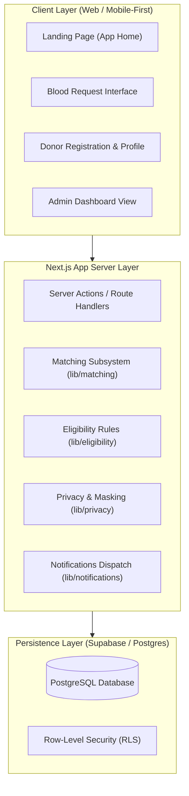

# Hemo Match System Architecture

**Project:** Hemo Match  
**Challenge:** SC-12 — District Blood Donor Matching  
**Status:** Foundation Layer Established (Milestone 1)  

---

## 1. High-Level System Overview

**Hemo Match** is designed to connect verified blood donors with urgent patient requirements at the district level. The architecture prioritizes rapid matching, strict donor medical eligibility, and privacy-first contact reveal protocols.



> [!NOTE]
> Currently, the project is in its **Foundation Phase**. Business logic, persistence schemas, authentication, and matching algorithms are deliberately stubbed and decoupled into modular libraries ready for phased implementation.

---

## 2. Directory Structure & Modular Layout

```
Hemo Match/
├── docs/                      # Architectural & progress documentation
│   ├── PROJECT_STATUS.md      # Current build state, handoff, and tasks
│   ├── ARCHITECTURE.md        # System design & module contracts (this file)
│   └── DECISIONS.md           # Architectural Decision Records (ADRs)
├── src/
│   ├── app/                   # Next.js App Router (pages, layouts, styles)
│   │   ├── favicon.ico
│   │   ├── globals.css        # Global CSS & Tailwind theme tokens
│   │   ├── layout.tsx         # Root layout with typography & metadata
│   │   └── page.tsx           # Clean healthcare-inspired landing page
│   ├── lib/                   # Isolated subsystem contracts & utilities
│   │   ├── matching/          # District matching algorithms & filters (stubbed)
│   │   ├── eligibility/       # Donor interval & medical health checks (stubbed)
│   │   ├── privacy/           # Phone masking & 2-way contact reveal (stubbed)
│   │   ├── notifications/     # In-app notification queue & alerts (stubbed)
│   │   ├── database/          # Supabase client wrapper & configuration (stubbed)
│   │   └── validation/        # Schema validators & input guards (stubbed)
│   └── types/                 # Shared TypeScript interfaces & domain enums
│       └── index.ts           # Central domain models (Donor, Request, District)
├── public/                    # Static brand assets
├── .env.example               # Safe environment variable template
├── next.config.ts             # Next.js framework configuration
├── tsconfig.json              # Strict TypeScript compiler options
└── package.json               # Dependencies and scripts (dev, build, lint, typecheck)
```

---

## 3. Subsystem Boundaries & Responsibilities

### 3.1 Donor Management
* **Planned Responsibility:** Donor onboarding, availability toggling (`available`, `paused`, `ineligible`), donation history tracking, and district assignment.
* **Current State:** Domain types defined in `src/types/index.ts`; registration validation contracts stubbed in `src/lib/validation/index.ts`.

### 3.2 Blood Requests
* **Planned Responsibility:** Intake for emergency blood requests (patient name, required blood group, units needed, hospital/district location, and urgency classification).
* **Current State:** Domain types defined in `src/types/index.ts`; request validation contracts stubbed in `src/lib/validation/index.ts`.

### 3.3 Matching Subsystem (`src/lib/matching/`)
* **Planned Responsibility:** Queries active eligible donors in the designated district/neighboring districts matching compatible blood groups (ABO and Rh factor).
* **Current State:** Stubs and interfaces defined (`MatchFilter`, `MatchCandidate`, `MatchResultSet`, `findMatchingDonors`).

### 3.4 Eligibility Rules Subsystem (`src/lib/eligibility/`)
* **Planned Responsibility:** Enforces minimum mandatory intervals (e.g. 90 days for whole blood donations), age boundaries (18-65), weight criteria, and temporary deferrals.
* **Current State:** Stubs and interfaces defined (`EligibilityInput`, `EligibilityAssessment`, `evaluateDonorEligibility`).

### 3.5 Privacy & Contact Reveal Subsystem (`src/lib/privacy/`)
* **Planned Responsibility:** By default, donor phone numbers are masked (`•••• ••1234`). Requesters must initiate a formal reveal request, which requires explicit donor approval before contact info is unmasked.
* **Current State:** Phone masking helper and reveal request contracts stubbed (`maskPhoneNumber`, `requestContactReveal`).

### 3.6 Notifications Subsystem (`src/lib/notifications/`)
* **Planned Responsibility:** Broadcasts match alerts, contact reveal requests, and emergency escalation notifications as in-app message feeds.
* **Current State:** Event models and stubbed dispatcher implemented (`sendInAppNotification`).

### 3.7 Database Subsystem (`src/lib/database/`)
* **Planned Responsibility:** Connection pooling and typed client queries via Supabase client, guarded by Row Level Security (RLS).
* **Current State:** Environment detector and config accessor stubs implemented (`getDatabaseConfig`, `getDbClient`).

### 3.8 Admin Dashboard
* **Planned Responsibility:** District-level oversight, unfulfilled urgent request alerts, audit logs of contact reveals, and donor activity metrics.
* **Current State:** Reserved for future implementation milestone.

---

## 4. Design System & Aesthetics Guidelines

The UI follows an **Apple Health & Modern Fintech** inspired visual design:
* **Background & Elevation:** Crisp, neutral canvas (`#FFFFFF` light mode / `#0A0A0A` dark mode) with subtle surface elevations (`bg-neutral-50`, `bg-white/80`).
* **Accents:** Restrained crimson/rose tones (`rose-600` / `#E11D48`) reserved for emergency signals, badges, and primary action affordances.
* **Containers:** Generously rounded cards (`rounded-2xl` to `rounded-3xl`) with hairline borders (`border-neutral-200/80`).
* **Typography:** System fonts / Geist Sans with accessible type hierarchy, clear contrast ratios, and tabular numerals where appropriate.
* **Responsive Paradigm:** Mobile-first layout prioritizing single-thumb accessibility on mobile screens while scaling gracefully to desktop viewports.
